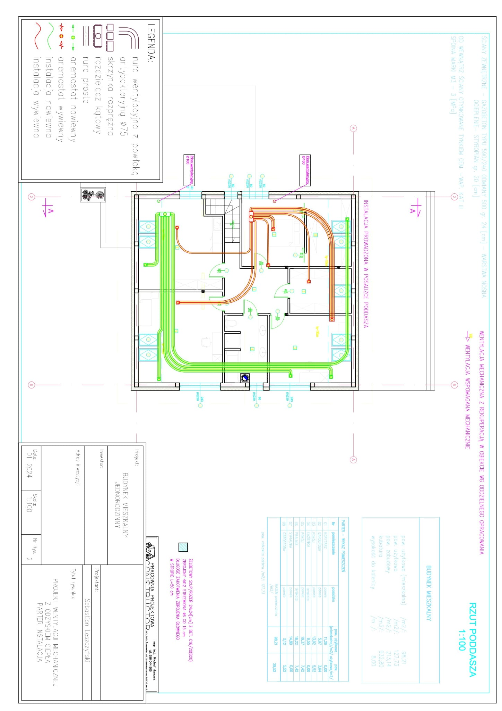

# Portfolio Inżyniera Instalacji Sanitarnych

Prosta strona internetowa portfolio dla inżyniera instalacji sanitarnych. Pliki w katalogu:

- `index.html` — główna strona
- `style.css` — stylizacja

## Jak opublikować na GitHub Pages

1. Utwórz nowe repozytorium na GitHub, np. `portfolio-sanitarne`.
2. Skopiuj pliki do lokalnego katalogu i wykonaj:
   ```bash
   git init
   git add .
   git commit -m "Pierwsza wersja portfolio"
   git branch -M main
   git remote add origin https://github.com/TWOJ_LOGIN/portfolio-sanitarne.git
   git push -u origin main
   ```
3. Wejdź do ustawień repozytorium na GitHub i włącz GitHub Pages z gałęzi `main`.
4. Po chwili strona będzie dostępna pod adresem `https://TWOJ_LOGIN.github.io/portfolio-sanitarne/`.

## Edycja zawartości

- Zmień swoje imię i dane kontaktowe w `index.html`.
- Dodaj kolejne projekty lub zdjęcia w sekcji `Wybrane projekty`.
- Możesz rozszerzyć stronę o kolejne sekcje, np. doświadczenie, certyfikaty lub referencje.

## Dodawanie obrazów do galerii

1. Utwórz folder `projects` obok `index.html`, np. `projects/`.
2. Skopiuj swoje obrazy (JPG, PNG) do tego folderu, np. `projects/projekt1.jpg`, `projects/projekt2.jpg`.
3. Otwórz `index.html` w edytorze i w sekcji "Galeria Projektów" zaktualizuj atrybuty `data-img` i `src` w elementach `.gallery-item`:
   ```html
   <div class="gallery-item" data-img="projects/projekt1.jpg">
     
   ```
4. Po odświeżeniu strony kliknięcie miniatury otworzy powiększony podgląd obrazu w modalu.

Przykład struktury:
```
seba/
  ├─ index.html
  ├─ style.css
  ├─ README.md
  └─ projects/
      ├─ projekt1.jpg
      ├─ projekt2.jpg
      └─ projekt3.jpg
```

Po wgraniu obrazów zatwierdź zmiany i wypchnij na GitHub:
```bash
git add .
git commit -m "Dodanie galerii obrazów"
git push
```
